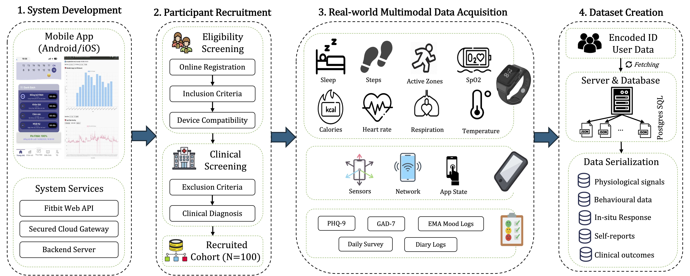

# A multimodal digital phenotyping dataset for depression and anxiety assessment under free-living conditions

[](https://zenodo.org/records/18976769)

<!-- --- -->

## Table of Contents
- [Abstract](#abstract)
- [Data Installation](#data-installation)
- [Usage Notes](#usage-notes)
- [Ethical Considerations](#ethical-considerations)
- [Citation](#citation)

---

## Abstract

Despite affecting hundreds of millions of people globally, depression and anxiety remain understudied through digital phenotyping in resource-constrained settings, where severe clinical workforce shortages heighten the need for scalable monitoring. 
To address this gap, this study presents Neurai-VN, a multimodal dataset integrating passive sensing and active assessments across multiple temporal scales. 
Data were collected from 100 Vietnamese adults recruited from the general population over two weeks. 
Participants were clinically assessed and grouped into four mutually exclusive groups based on their primary clinical diagnoses: depressive disorders, anxiety disorders, healthy controls, and other psychiatric conditions.
The dataset contains (1) continuous wearable physiological signals and smartphone-derived behavioral data captured under free-living conditions; (2) clinical assessment data, including DSM-5-based psychiatric diagnoses and symptom severity ratings; and (3) repeated self-reports.
The released dataset comprises 1,730 participant-day records from 14 passive sensing modalities and 3,642 longitudinal self-report records including PHQ-9 and GAD-7 assessments, daily symptom reports, and mood logs.
The Neurai-VN provides a resource for benchmarking machine learning models, evaluating generalizability, and investigating multimodal digital biomarkers for depression and anxiety research in an underrepresented population.

<p align="center">
  
</p>

<p align="center"><em>
Figure 1. Workflow for constructing the \textsc{Neurai-VN} dataset. First, a mobile application was developed for multimodal data acquisition. Next, participants were recruited, clinically screened for eligibility, and enrolled. Subsequently, data from multiple modalities were collected under real-world conditions. Finally, the collected data underwent retrieval, quality control, and serialization to generate the released dataset.
</em></p>

---

## Data Installation

The NEURAI-VN dataset is distributed as CSV exports at two temporal resolutions: daily and per-minute, to facilitate immediate use across Python and other programming environments while maintaining storage and memory efficiency. The dataset is hosted on [Zenodo](https://zenodo.org/), a general-purpose open-access repository, and is publicly available at [https://zenodo.org/records/18976769](https://zenodo.org/records/18976769).

All data have undergone extensive cleaning and preprocessing prior to export to support downstream analyses. While the original PostgreSQL database exceeds 30GB in size, the processed CSV files provide a lightweight and user-friendly alternative that can be loaded with minimal effort, as described in the accompanying repository documentation. All timestamps are reported in local time.

The dataset is organized into two (02) main directories:

- **Participants**: This directory contains data from all 100 participants. Each participant is assigned a unique anonymized identifier (e.g., `P0001`) and stored in a separate de-identified folder. Each participant folder contains 18 CSV files spanning three data modalities: wearable sensor streams ($n=8$), smartphone behavioral logs ($n=6$), and ecological momentary assessments (EMAs; $n=4$).

- **Metadata**: This directory contains study-level metadata, including demographic information ($n=1$) and clinical annotations ($n=1$).

For automatic data installation, please follow the instructions below to download and extract the dataset from Zenodo. In addition, please ensure you have the necessary permissions and tools to access the dataset.

```bash
chmod +x script/data_installer.sh
./script/data_installer.sh
```

---

## Data Sample
The figure below shows an example of passive sensing data collected from a real participant. The upper panels present wearable-derived signals, while the lower panels show representative smartphone sensing data.

<p align="center">
  
</p>

<p align="center"><em>
Figure 2. Representative passive sensing data from participant P0065 collected between November 1 and November 16. The top row shows wearable-derived measurements, including heart rate, sleep, and step count. The bottom row shows representative smartphone sensing data, including gyroscope, accelerometer, and Wi-Fi connectivity.
</em></p>


---
## Usage Notes
This dataset is publicly available via Zenodo under a Creative Commons license. It is provided for scientific and educational use only. Users agree not to attempt re-identification of any individuals, institutions, or hospitals. Any use of the dataset must include citation of the associated publication. Users of these data are requested to cite the Zenodo record (DOI) in any resulting publications, presentations, software, or derivative works.
A peer-reviewed publication associated with this dataset will be linked upon publication.

For questions concerning the dataset, please contact: [24cuong.pq@vinuni.edu.vn](mailto:24cuong.pq@vinuni.edu.vn)

---
## Ethical Considerations
This study was approved by the Institutional Review Board (IRB) of Neurology Department, Nguyen Tri Phuong Hospital (No. 1387/NTP-HDDD). 
The written consent was obtained from all participants prior to data collection after they received detailed information about the study objectives, experiment procedures, data types, potential risks and the measures implemented to mitigate them. Participants were informed of their right to decline or withdraw from the study at any time without consequence. 

---

## Citation

If you find this work useful, please cite our paper:

```bibtex
@dataset{cuong_q_pham_2026_18976769,
  author       = {Cuong Q. Pham and
                  Duong T. H. Vu and
                  Long K. H. Nguyen and
                  Hung K. Nguyen and
                  Thu M. N. Phan and
                  Dung T. T. Duong and
                  Duy T. H. Le and
                  Nicolas Vuillerme and
                  Huong T. T. Ha and
                  Hieu H. Pham},
  title        = {Neurai-VN, A Multimodal Digital Phenotyping
                   Dataset for Depression and Anxiety Assessment in
                   Free-Living Conditions
                  },
  month        = may,
  year         = 2026,
  publisher    = {Zenodo},
  version      = {1.0.0},
  doi          = {10.5281/zenodo.18976769},
  url          = {https://doi.org/10.5281/zenodo.18976769},
}
```
